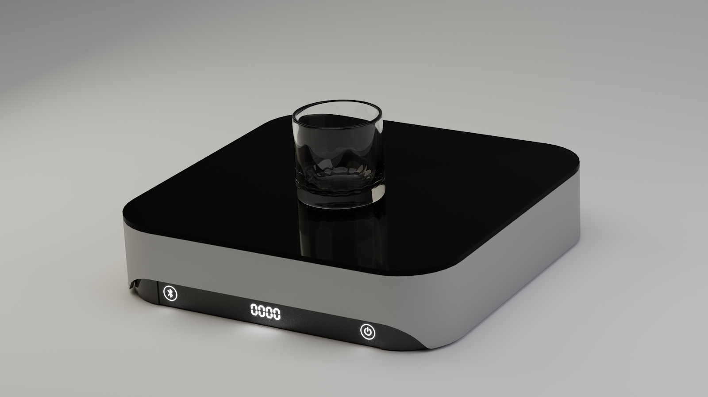

# Wireless Smart Scale Application (WIP)

**This project has been abandoned.** In order to continue, the project needs to be documented and refactored to work
with a more recent Flutter version.

## Working principle

The app broadcasts itself in the local network when looking for a scale to connect to.\
The scale listens to this broadcast and acks when one is found.\
After the scale has been connected, it starts sending weight packets and receiving tare and calibration commands.\
Weight packets are parsed and sunk into a stream controller, that can be listened to.

## Application design

The app uses BLoC pattern via the `bloc` library and implements it with `flutter_bloc` state-reactive components.

## UI Designs / Screenshots

  
  
  
  
  
  
  
  

